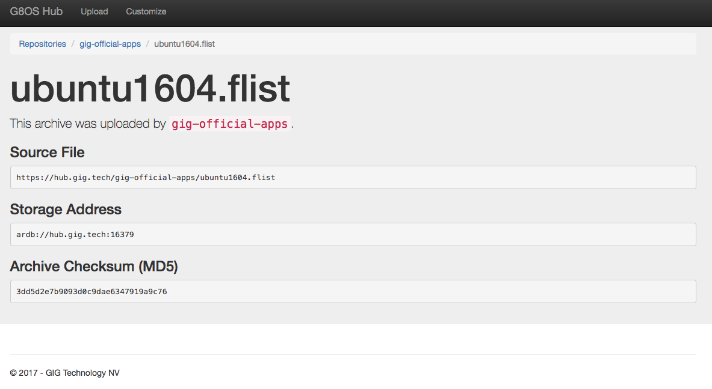

# Creating Containers

In the below example a very basic container is created with only the root file system mounted.

We use the [ubuntu1604.flist](https://hub.gig.tech/gig-official-apps/ubuntu1604.flist.md) flist from the [gig-official-apps repository on the Zero-OS Hub](https://hub.gig.tech/gig-official-apps):



Here's the Python script using the Zero-OS Python client:

```python
from zeroos.core0.client import Client
cl = Client("<IP address Zero-OS node>")

flist = 'https://hub.gig.tech/gig-official-apps/ubuntu1604.flist'

job = cl.container.create(flist, storage='ardb://hub.gig.tech:16379')
container_id = job.get()
container = cl.container.client(container_id)

print(container.system('ls -l /opt').get())
```

> In the above example we explicitly specified with the `storage` argument that we want to mount the ARDB storage cluster of the Zero-OS Hub. When omitting this optional argument the default storage cluster of the Zero-OS node will be used. This default is set with the `storage` global parameter as documented in [Main Configuration](../config/main.md).

See the [Creating an OpenSSH Container](../interacting/examples/openssh.md) example for more elaborate example.

See [Container Commands](../interacting/commands/container.md) for all available commands for managing containers.

Also see the tutorial about this topic: [Create a Flist and Start a Container](https://github.com/zero-os/home/blob/master/docs/tutorials/Create_a_Flist_and_Start_a_Container.md)
