# Step by step getting started with Zero-OS

Also see the recorded session on Zoom: [Getting started with Zero-OS](https://zoom.us/recording/play/Px0ZhKXKRGKSUdfac_J1-S9TS24YS1aBdI1iItnKJSz4RnP1SLgBIG0ABSEDdyQE) 

Here are the steps:
- [Create ZeroTier network](#create-zt)
- [Create ItsYou.online organization](#iyo-org)
- [Create ItsYou.online API key](#iyo-apikey)
- [Get iPXE Boot script](#ipxe)
- [Boot Zero-OS on Packet.net](#packet)
- [Setup your JumpScale sandbox](#sandbox-setup)
- [Join your sandbox into ZeroTier network](#join-zt)
- [Initialize Config Manager](#initialize-config-manager)
- [Get a JSON Web token (JWT)](#get-jwt)
- [Connect to the Zero-OS node](#connect-node)
- [Create a Zero-OS container](#create-container)
- [SSH into container](#ssh)

<a id="create-zt"></a>

## Create ZeroTier network

Go to:
https://my.zerotier.com/


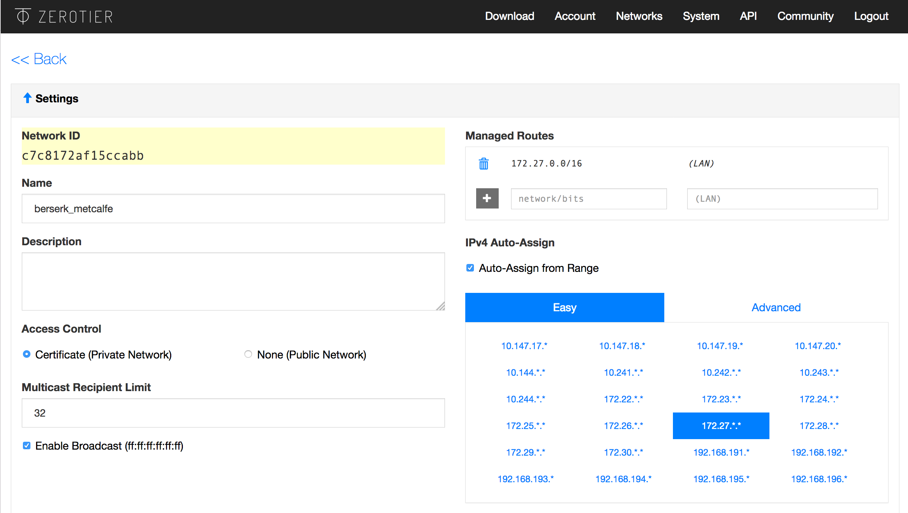


<a id="iyo-org"></a>

## Create ItsYou.online organization

Go to:
https://www.itsyou.online


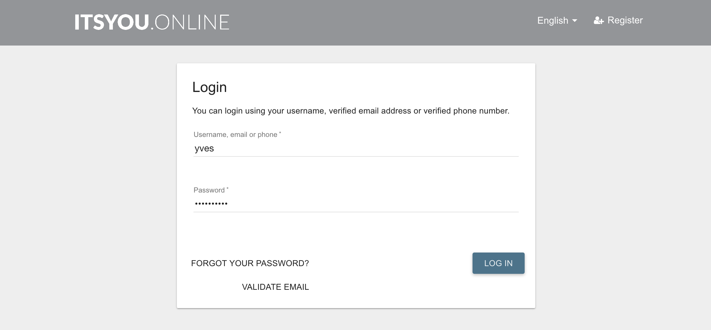


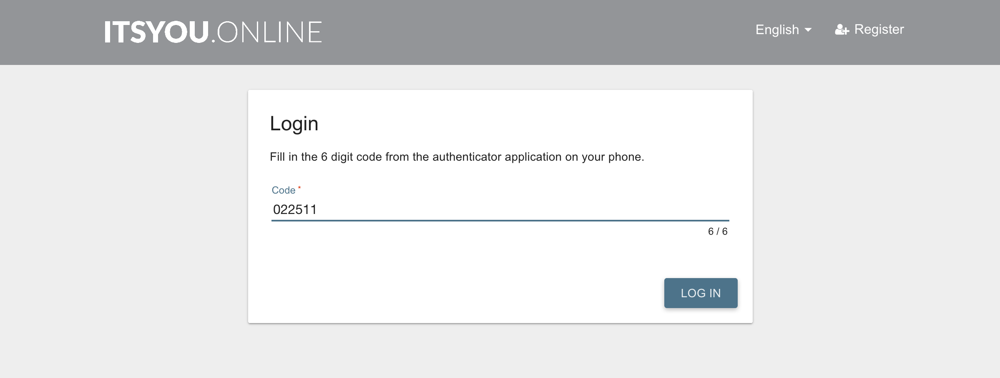


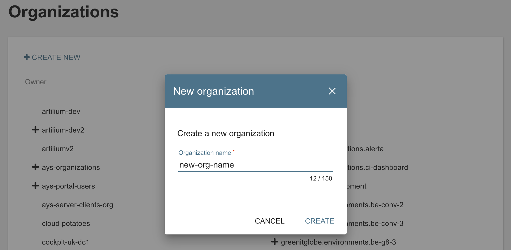


<a id="iyo-apikey"></a>

## Create ItsYou.online API key

Go to:
https://itsyou.online/#/settings

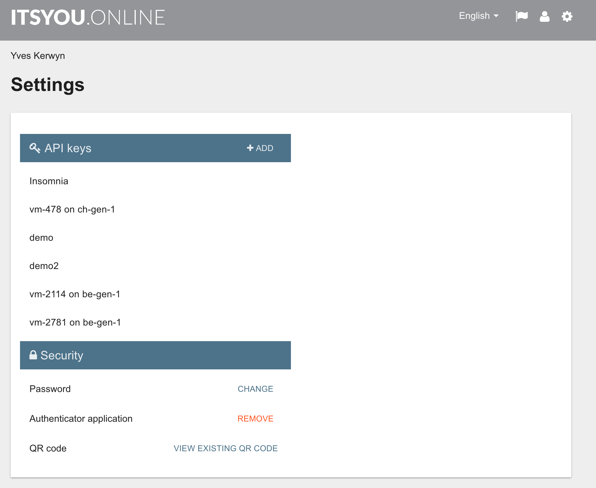

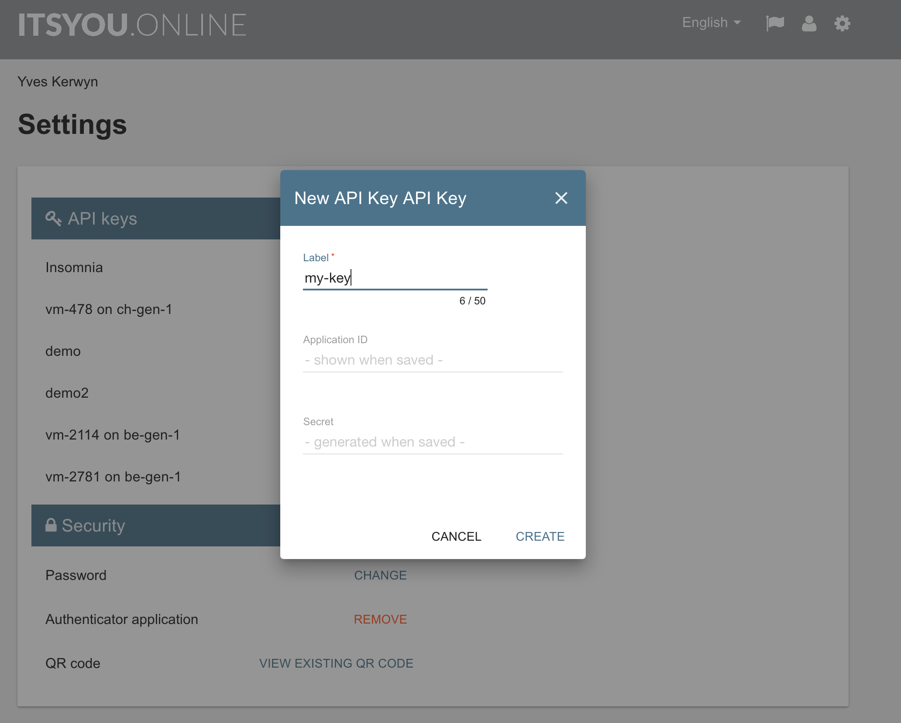


<a id="ipxe"></a>

## Get iPXE Boot script

See: https://en.wikipedia.org/wiki/IPXE

Boot a Zero-OS node on Packet.net, as documented in [Booting Zero-OS on Packet.net](https://github.com/zero-os/0-core/blob/master/docs/booting/packet.md).

Go to:
- https://bootstrap.gig.tech/generate

Next to specifying the Zero-Tier network, also pass following kernel parameters, separated by spaces `%20`:
- `organization=<org>`
- `development`

The last one will allow you to directly interact with the redis interface of the Zero-OS node. In production you will not allow that, all interaction will need to go through a node-robot. So if `development` set, the redis-proxy allows direct client connections, for which the required client ports will be opened when booting. If not set, no direct client connections will be allowed. If you want the redis to listen on ZeroTier you need to have the development kernel param set.

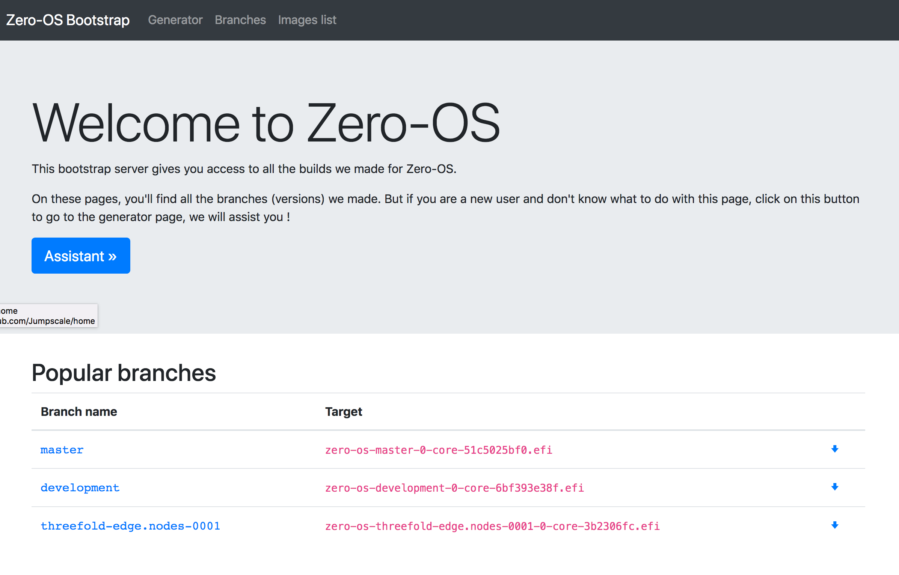

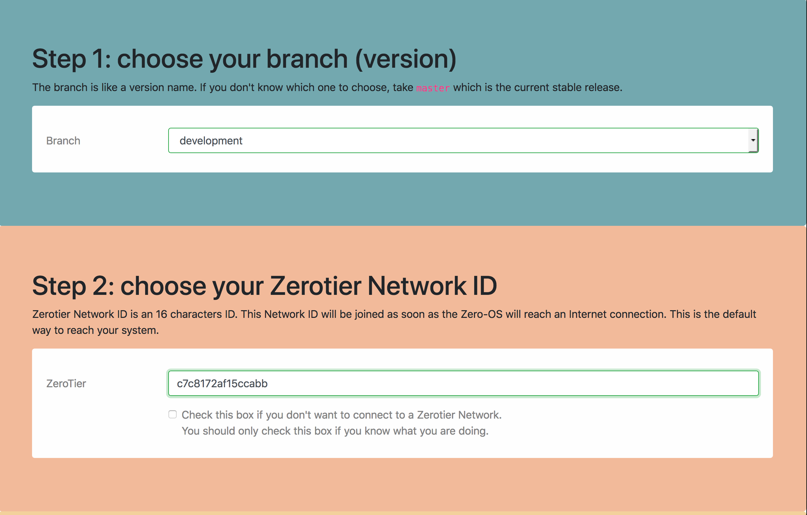

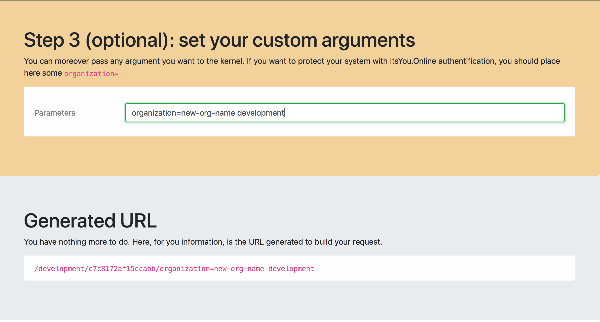

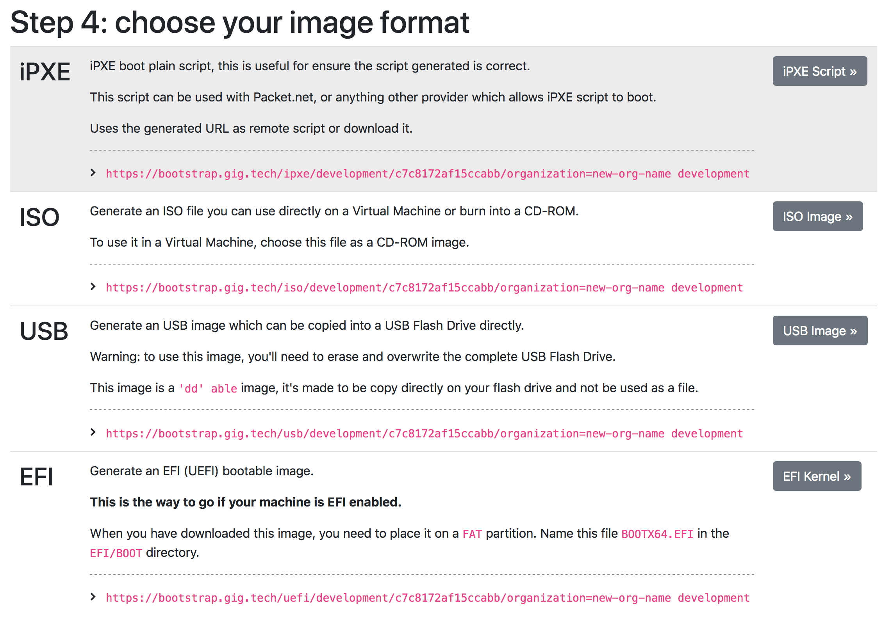


Here's the URL for the iPXE boot script for the ZeroTier network for id `17d709436c5bc232` and ItsYou.online organization `my-zero-or-org`, enabled (with the `development` kernel flag) for listing for Redis commands on the default port:  https://bootstrap.gig.tech/ipxe/master/17d709436c5bc232/organization=my-zero-os-org%20development


For more info see: 
- https://github.com/zero-os/0-core/blob/master/docs/booting/README.md
- https://github.com/zero-os/0-bootstrap#arguments


<a id="packet"></a>

## Boot a machine on Packet.net
Go to:
https://app.packet.net/login


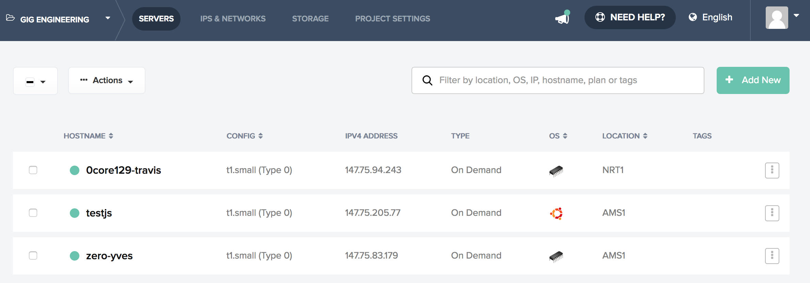

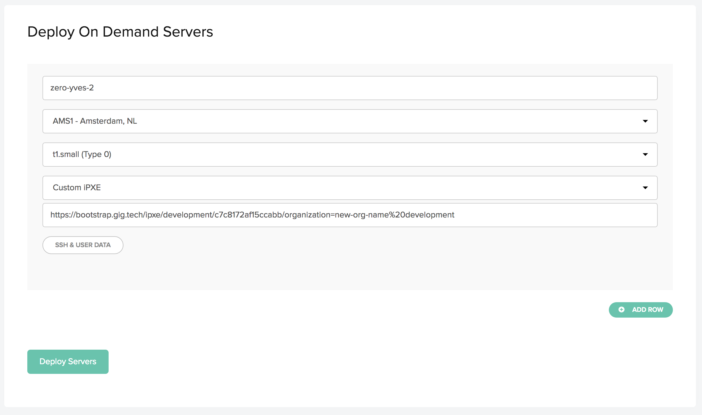

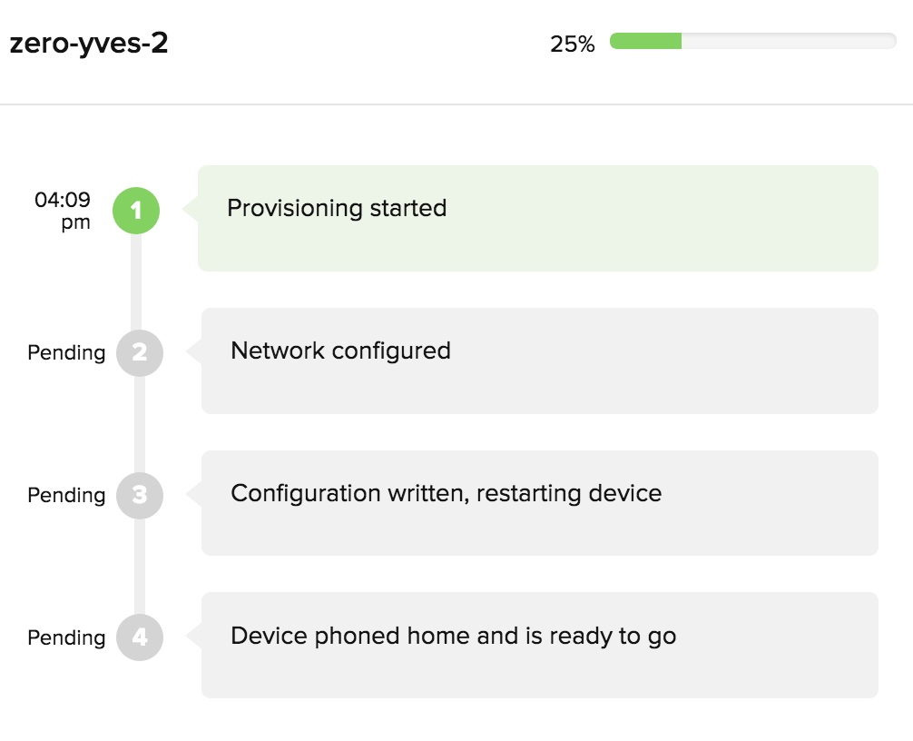

Next you will need to authorize the ZeroTier join request from the Zero-OS node.

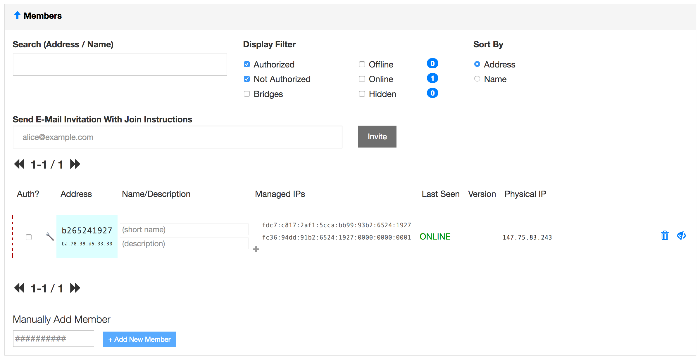


<a id="sandbox-setup"></a>

## Setup your JumpScale sandbox

Get into a JumpScale sandbox:
```bash
mkdir -p /opt/bin
wget -O /opt/bin/zbundle https://download.gig.tech/zbundle
tmux
cd /opt/bin
chmod +x zbundle
./zbundle --id test --entry-point /bin/bash --no-exit https://hub.gig.tech/fastgeert/jumpscale-reportbuilder-latest.flist
```

Split TMUX session and execute:
```
chroot /tmp/zbundle/mysandbox
echo "nameserver 8.8.8.8" > /etc/resolv.conf
```

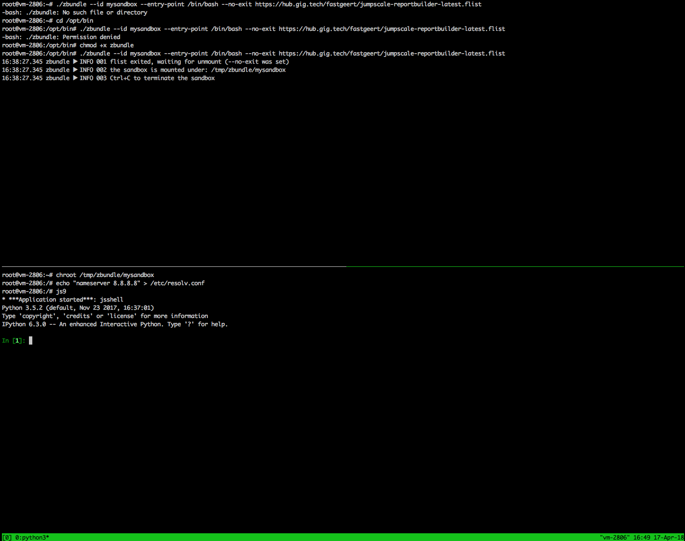


<a id="join-zt"></a
## Join your sandbox into ZeroTier network

Get and start ZeroTier:
```bash
curl -s https://install.zerotier.com/ | sudo bash
zerotier-one -d
```

Join the ZT network as documented in [Join the ZeroTier Management Network](https://github.com/zero-os/0-core/blob/master/docs/interacting/zerotier.md).
```bash
ZEROTIER_NETWORK_ID=17d709436c5bc232
zerotier-cli join $ZEROTIER_NETWORK_ID
```

Again you need to authorize this join request to:

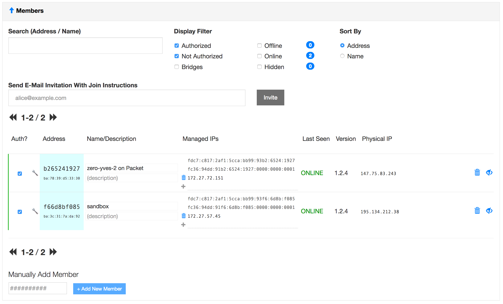

Install `python-jose`:
```bash
pip install python-jose
```

Start JS sandbox:
```bash
js9
```

<a id="initialize-config-manager"></a
## Initialize Config Manager

Execute the following in the interactive shell:
```python
j.tools.prefab.local.system.ssh.keygen(user='root', name='id_rsa')

jsconfig = {}
jsconfig["email"] = "yves@gig.tech"
jsconfig["login_name"] = "yves"
jsconfig["fullname"] = "Yves Kerwyn"

ssh_key_path = "/root/.ssh/id_rsa"
config_path = "/opt/myconfig"

j.tools.configmanager.init(data=jsconfig, silent=True, configpath=config_path, keypath=ssh_key_path)
```


<a id="get-jwt"></a>
## Get a JSON Web token (JWT)

In order to get a JWT we first need to create a config instance for ItsYou.online, here the application ID and secret have been saved first environment variables:
```python
import os
app_id = os.environ["APP_ID"]
secret = os.environ["SECRET"]
iyo_config = {
    "application_id_": app_id,
    "secret_": secret
}
iyo_client = j.clients.itsyouonline.get(instance='main', data=iyo_config, create=True, die=True, interactive=False)
```

Get a JWT:
```python
iyo_organization = "my-zero-os-org"
iyo_client = j.clients.itsyouonline.get(instance="main")
memberof_scope = "user:memberof:{}".format(iyo_organization)
jwt = iyo_client.jwt_get(scope=memberof_scope)
```

<a id="connect-node"></a>
## Connect to the Zero-OS node

In JumpScale check for existing configuration instances for Zero-OS:
```python
j.clients.zero_os.list()
```

In order to get an existing node:
```python
node = j.clients.zero_os.get(instance="node1")
```

To delete the config instance:
```python
j.clients.zero_os.delete("node1")
```

In order to create a new configuration instance:
```python
# Optionally omit data when using the config manager
# The config manager will then prompt for the necessary client data
# In fact this step can be skipped when using the config manager
# It will ask for for the client data when `get_node` is called when there is no client yet for the instance
zos_data = {
    "host": "10.147.18.218",
    "port": 6379,
    "password_": jwt
}

zos_client = j.clients.zero_os.get(instance="node1", data=zos_data)
```

In order to update the config instance, here the IP address:
```python
new_ip_address = "10.147.18.218"
zos_data  = zos_client.config
data_set(key="host", val=new_ip_address, save=True)
```

Get a node interface:
```python
node = j.clients.zero_os.sal.get_node(instance="node1")
```

Check:
```python
node.is_running()
```


<a id="create-container"></a>

## Create a Zero-OS container

For all flists go to:
https://hub.gig.tech/gig-official-apps/


Here we use the flist for Ubuntu 16.04:
https://hub.gig.tech/gig-official-apps/ubuntu1604.flist.md


Execute the following to create the container:
```python
container_name = "my_container"
host_name = "yvescontainer"
ubuntu_flist = "https://hub.gig.tech/gig-official-apps/ubuntu1604.flist"
node.containers.create(name=container_name, flist=ubuntu_flist, hostname=host_name, nics=[{"type": "default"}], ports={2200: 22})
my_container = node.containers.get(name=container_name)
my_container.info                        
```

Examples on how to use the SAL, see the 0-templates:
https://github.com/zero-os/0-templates/tree/master/templates


<a id="ssh"></a>
## SSH into container

In order to start SSHD, we first need to make sure the host keys can be loaded, and that the privilege separation directory `/var/run/sshd` exists:
```python
container_cl = my_container.client
job = container_cl.system(command='dpkg-reconfigure openssh-server')
job.get()

fs = container_cl.filesystem
fs.mkdir(path="/var/run/sshd")
```

Check running processes:
```python
container_cl.process.list()
```

Check files:
```python
client = my_container.client
fs = client.filesystem
fs.list('/root')
fs.list('/root/.ssh')
```

Authorize your public key
```python
my_container.client.bash(script="curl https://github.com/yveskerwyn.keys > /root/.ssh/authorized_keys").get()
my_container.download_content('/root/.ssh/authorized_keys')
```

Enable root access:
```python
my_container.client.bash(script="sudo sed -i 's/prohibit-password/without-password/' /etc/ssh/sshd_config").get()
#my_container.client.bash(script="sudo sed -i 's/PermitRootLogin yes/PermitRootLogin without-password/' /etc/ssh/sshd_config").get()
```

Check the result, `PermitRootLogin` should be set to `without-password` now:
```python
my_container.client.bash(script="cat /etc/ssh/sshd_config").get()
```

Open port 2200 on the node:
```bash
nft = node.client.nft
nft.open_port(2200)
```

And finally, start SSH daemon:
```python
container_cl.job.list()
job = my_container.client.system(command='sshd')
job.running
job.get()
```

In case you need to restart the SSH daemon, first find the PID of sshd and that kill the process, and restart:
```python
my_container.client.process.list()
my_container.client.process.kill(pid=120)
job = my_container.client.system(command='sshd')
job.running
job.get()
```